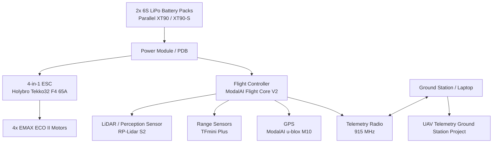

# UAV System Architecture

This repository documents a hands-on field robotics UAV build focused on hardware/software integration, telemetry, sensing, power distribution, and future autonomy workflows.

## System block diagram

## Integration focus

This project is not just a parts list. The purpose is to show systems integration thinking:

- power flow
- sensor layout
- telemetry plan
- safety checklist
- bring-up sequence
- failure modes
- field-test workflow
- software tooling for logs and diagnostics
